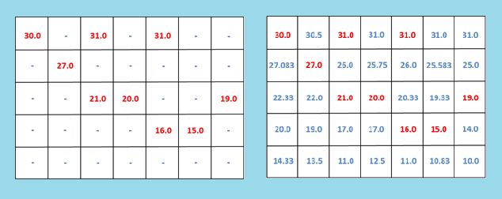

# Interpolation of 2D data

Program requires a CSV file as input where 

empty spaces are to be mentioned with 'characters' or 'symbols' 

whereas non-empty spaces with 'integer' or 'decimal' values. 

Logic implemented is explained in the following paper:
[https://ieeexplore.ieee.org/document/8777680]
